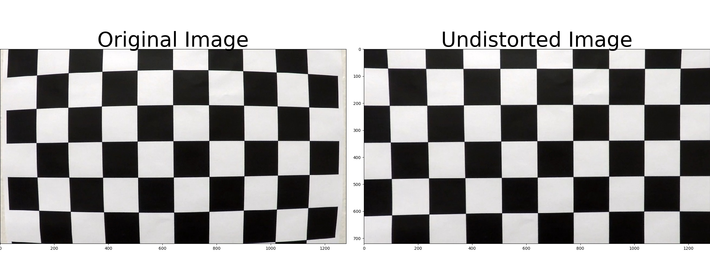
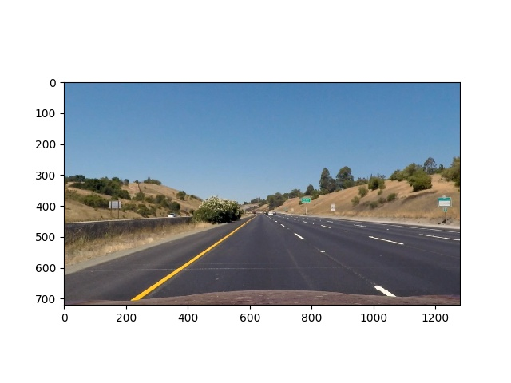
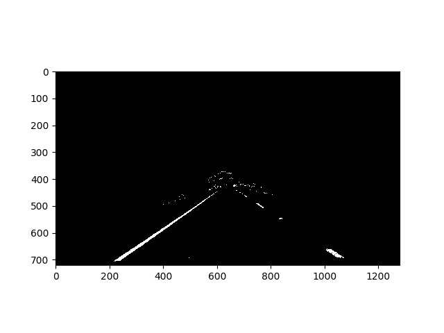
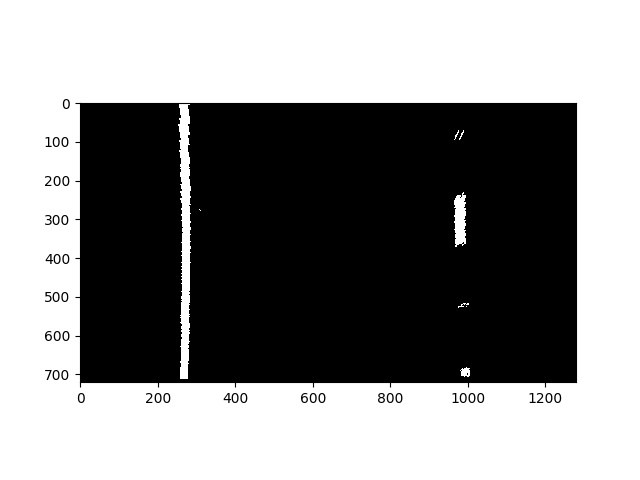
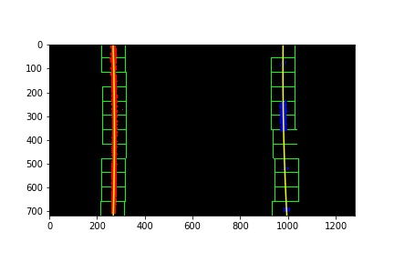
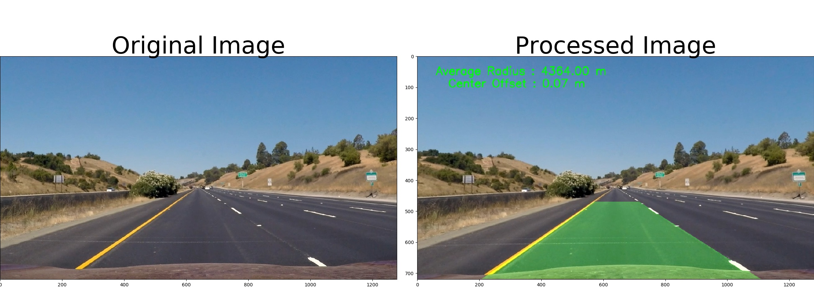

**Advanced Lane Finding Project**

The goals / steps of this project are the following:

* Compute the camera calibration matrix and distortion coefficients given a set of chessboard images.
* Apply a distortion correction to raw images.
* Use color transforms, gradients, etc., to create a thresholded binary image.
* Apply a perspective transform to rectify binary image ("birds-eye view").
* Detect lane pixels and fit to find the lane boundary.
* Determine the curvature of the lane and vehicle position with respect to center.
* Warp the detected lane boundaries back onto the original image.
* Output visual display of the lane boundaries and numerical estimation of lane curvature and vehicle position.

### Writeup / README

#### 1. Provide a Writeup / README that includes all the rubric points and how you addressed each one.  

You're reading it!

### Camera Calibration

#### 1. Briefly state how you computed the camera matrix and distortion coefficients. Provide an example of a distortion corrected calibration image.

The code for this step is contained in the file calibrate.py line #20 to line #73.  

I start by preparing "object points", which will be the (x, y, z) coordinates of the chessboard corners in the world. Here I am assuming the chessboard is fixed on the (x, y) plane at z=0, such that the object points are the same for each calibration image.  Thus, `objp` is just a replicated array of coordinates, and `objpoints` will be appended with a copy of it every time I successfully detect all chessboard corners in a test image.  `imgpoints` will be appended with the (x, y) pixel position of each of the corners in the image plane with each successful chessboard detection.  

I then used the output `objpoints` and `imgpoints` to compute the camera calibration and distortion coefficients using the `cv2.calibrateCamera()` function.  I applied this distortion correction to the test image using the `cv2.undistort()` function and obtained this result: 

### Pipeline (single images)

All constants that are used is stored in the file globalvars.py. The main thread that orchestrates is in the file process_image.py.  The function process_image at line #43 to #116 processes each frame of the video and uses the other pipeline to convert the frame with lane lines marked along with displaying the radius of curvature and center offset.

#### 1. Provide an example of a distortion-corrected image.

Distortion correction caliculated via camera calibration is applied to each image in the frame.
To demonstrate this step, I will describe how I apply the distortion correction to one of the test images like this one:

#### 2. Describe how (and identify where in your code) you used color transforms, gradients or other methods to create a thresholded binary image.  Provide an example of a binary image result.

I used a combination of color and gradient thresholds to generate a binary image (thresholding steps at lines #8 through #109 in threshold.py).  Here's an example of my output for this step.  

#### 3. Describe how (and identify where in your code) you performed a perspective transform and provide an example of a transformed image.

We want to transform the image to a bird's eye view to make it easier to identify lane lines. This is achieved using perspective transform. The code for my perspective transform includes a function called `unwarp()`, which appears in lines 1 through 8 in the file `transform.py`.  The `unwarp()` function takes as inputs an image (`img`), as well as source (`src`) and destination (`dst`) points.  I chose the hardcode the source and destination points in the following manner:

src = np.float32(
    [[(img_size[0] / 2) - 55, img_size[1] / 2 + 100],
    [((img_size[0] / 6) - 10), img_size[1]],
    [(img_size[0] * 5 / 6) + 60, img_size[1]],
    [(img_size[0] / 2 + 55), img_size[1] / 2 + 100]])
dst = np.float32(
    [[(img_size[0] / 4), 0],
    [(img_size[0] / 4), img_size[1]],
    [(img_size[0] * 3 / 4), img_size[1]],
    [(img_size[0] * 3 / 4), 0]])

This resulted in the following source and destination points:

| Source        | Destination   | 
|:-------------:|:-------------:| 
| 570, 470      | 280, 0        | 
| 220, 720      | 280, 720      |
| 1110, 720     | 1000, 720      |
| 722, 470      | 1000, 0        |

I verified that my perspective transform was working as expected by drawing the `src` and `dst` points onto a test image and its warped counterpart to verify that the lines appear parallel in the warped image.

#### 4. Describe how (and identify where in your code) you identified lane-line pixels and fit their positions with a polynomial?

Lane line pixesls are identified in perspective transfored image in thsi step. We fit a 2nd order polynomial to fit the lane line in this step. I detected lane line using sliding window in lanedetect.py. I initially do the sliding window search to identify lane lines. But once found, i start searching for lanes in the windows close to the old identified window.  

#### 5. Describe how (and identify where in your code) you calculated the radius of curvature of the lane and the position of the vehicle with respect to center.

I did this in lines #178 through #204 in the function measure_curvature_real in my code in `linedetect.py`. I had to convert the pixel space to real space. I used the ploynomial fits data to calculate the curvature. Position of the vehicle with respect to center is implemented in #201 to #212 the function offset_center in linedetect.py

#### 6. Provide an example image of your result plotted back down onto the road such that the lane area is identified clearly.

I implemented this step in lines #43 through #66 in my code in `transform.py` in the function `inverse_warp()`.  Here is an example of my result on a test image:

---

### Pipeline (video)

#### 1. Provide a link to your final video output.  Your pipeline should perform reasonably well on the entire project video (wobbly lines are ok but no catastrophic failures that would cause the car to drive off the road!).

Here's a [link to my video result](./output_images/project_video.mp4)

Here's a [link to challenge video result](./output_images/challenge_video.mp4)

---

### Discussion

#### 1. Briefly discuss any problems / issues you faced in your implementation of this project.  Where will your pipeline likely fail?  What could you do to make it more robust?

Need further tuning for threshold values to handle deep curves and shadows as shown in challenge_video.mp4. Need more sanity checks to handle invalid cases. Error handling need to improved to handle tough road conditions. 
